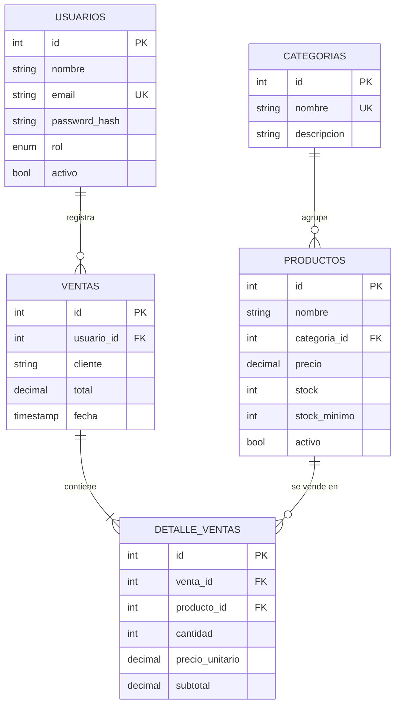

# Diagrama de la base de datos (DER)

```mermaid
erDiagram
  USUARIOS ||--o{ VENTAS : registra
  CATEGORIAS ||--o{ PRODUCTOS : agrupa
  VENTAS ||--|{ DETALLE_VENTAS : contiene
  PRODUCTOS ||--o{ DETALLE_VENTAS : "se vende en"

  USUARIOS { int id PK  string nombre  string email UK  string password_hash  enum rol  bool activo }
  CATEGORIAS { int id PK  string nombre UK  string descripcion }
  PRODUCTOS { int id PK  string nombre  int categoria_id FK  decimal precio  int stock  int stock_minimo  bool activo }
  VENTAS { int id PK  int usuario_id FK  string cliente  decimal total  timestamp fecha }
  DETALLE_VENTAS { int id PK  int venta_id FK  int producto_id FK  int cantidad  decimal precio_unitario  decimal subtotal }
```
